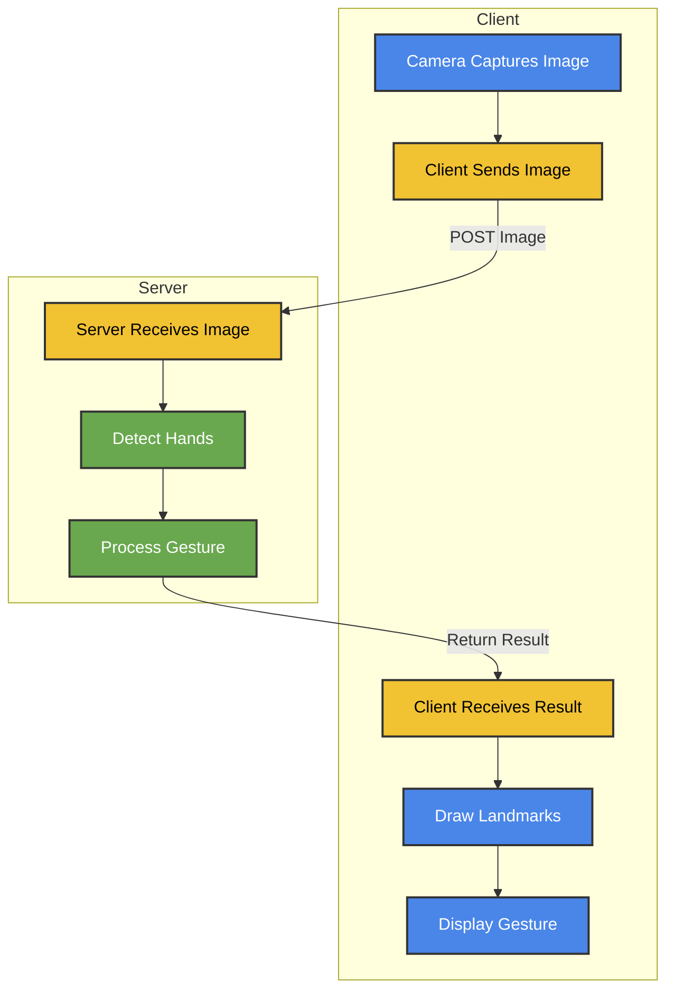

# Hand Gesture Detection and Streaming Server

This project implements a FastAPI server that handles real-time hand gesture detection. The server processes images sent by clients, detects hand gestures, and returns the results to the clients.

## How It Works

The server processes incoming images from clients and detects hand gestures. The flow of the application is as follows:

1. The client captures an image from the camera.
2. The image is sent to the server via a POST request.
3. The server receives the image and processes it to detect hands and analyze gestures.
4. The server returns the detection results, including the detected gesture and hand landmarks.
5. The client receives the results and updates the UI accordingly, drawing the landmarks and displaying the detected gesture.

This process happens for each frame, creating a real-time interaction between the client and the server for continuous hand gesture detection.

## Project Structure

The project is organized as follows:

hand_gesture  
 ┣ app  
 ┃ ┣ `config.py` # Configuration settings for the server and application  
 ┃ ┣ `hand_detection.py` # Functions for detecting hand gestures in images  
 ┃ ┣ `main.py ` # Main entry point for the FastAPI server  
 ┃ ┗ `utils.py` # Utility functions used across the application  
 ┣ static  
 ┃ ┣ css  
 ┃ ┃ ┗ `style.css` # Stylesheets for the front-end  
 ┃ ┗ js  
 ┃ ┃ ┣ `camera-streaming.js` # Handles camera input and streaming on the client-side  
 ┃ ┃ ┣ `config.js` # Client-side configuration settings  
 ┃ ┃ ┣ `main.js` # Main JavaScript file for client-side logic  
 ┃ ┃ ┗ `ui-manager.js` # Manages UI interactions and updates  
 ┣ templates  
 ┃ ┗ `index.html` # Main HTML template for the web interface  
 ┗ `.gitignore ` # Specifies files and directories to be ignored by Git

## API Endpoints

- `GET /`: Serves the main index page.
- `POST /process_image/`: Receives an image from the client, processes it for hand gesture detection, and returns the result.
