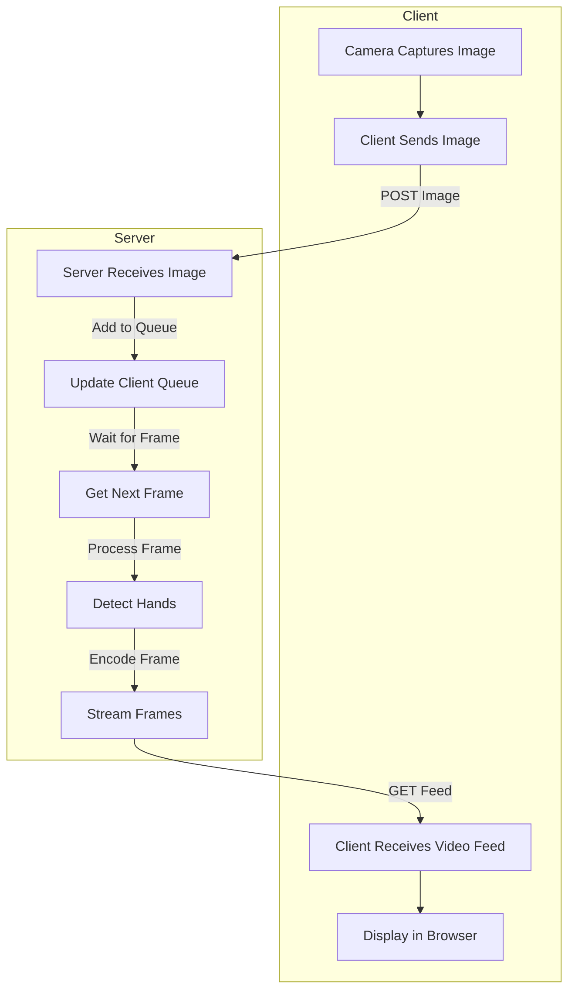

# Hand Gesture Detection and Streaming Server
This project implements a FastAPI server that handles real-time image processing and streaming. The server detects hand gestures from images sent by clients and streams the processed images back to the clients' browsers.

## How It Works

The server processes incoming images from clients, detects hand gestures, and streams the processed images back to the clients. The flow of the server is as follows:

## Project Structure
The project is organized as follows:

hand_gesture  
 ┣ app  
 ┃ ┣ `config.py`            # Configuration settings for the server and application  
 ┃ ┣ `hand_detection.py`    # Functions for detecting hand gestures in images  
 ┃ ┣ `main.py `             # Main entry point for the FastAPI server  
 ┃ ┗ `utils.py`             # Utility functions used across the application  
 ┣ static  
 ┃ ┣ css  
 ┃ ┃ ┗ `style.css`          # Stylesheets for the front-end  
 ┃ ┗ js  
 ┃ ┃ ┣ `camera-streaming.js` # Handles camera input and streaming on the client-side  
 ┃ ┃ ┣ `config.js`          # Client-side configuration settings  
 ┃ ┃ ┣ `main.js`            # Main JavaScript file for client-side logic  
 ┃ ┃ ┗ `ui-manager.js`      # Manages UI interactions and updates  
 ┣ templates  
 ┃ ┗ `index.html`           # Main HTML template for the web interface  
 ┗ `.gitignore `            # Specifies files and directories to be ignored by Git  

## API Endpoints
- `GET /`: Serves the main index page.
- `POST /process_image/{client_id}`: Receives an image from the client and adds it to the processing queue.
- `GET /video_feed/{client_id}`: Streams the processed video feed back to the client.